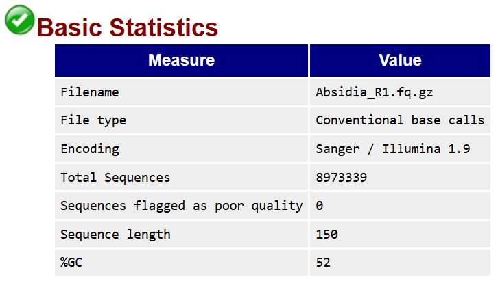
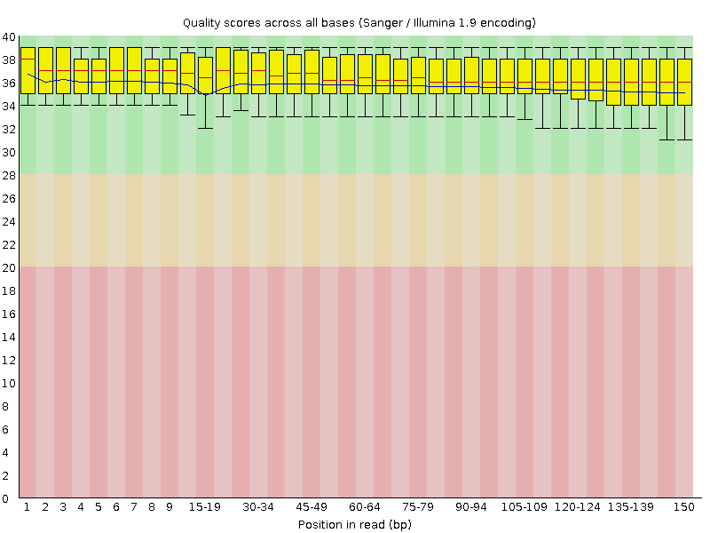
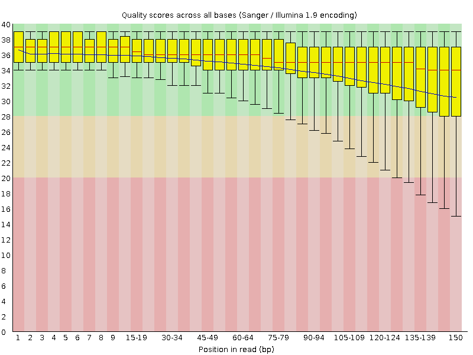
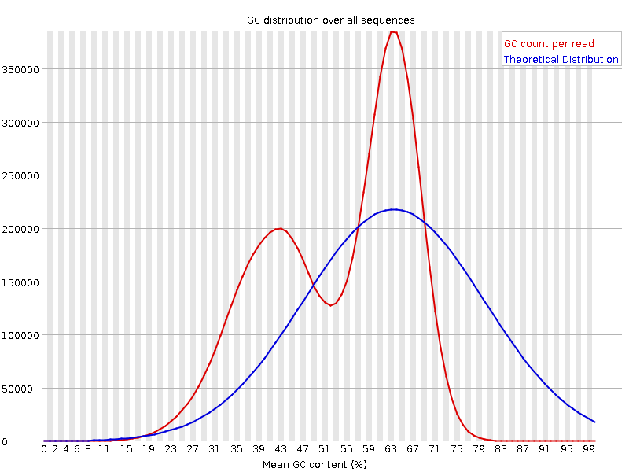
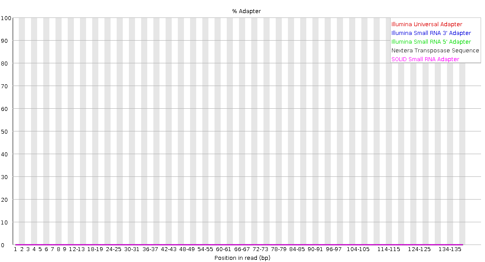
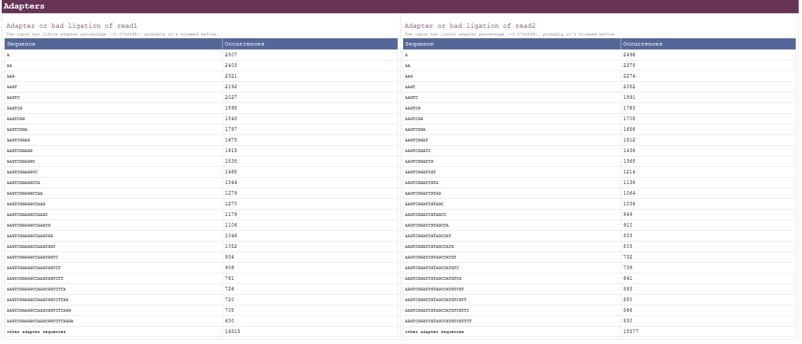

# Oficina prática 3: Processamento e Análise de Dados Genômicos

Nesta aula prática, serão abordados os principais passos de uma análise genômica, desde o recebimento dos dados de sequenciamento até a obtenção de um genoma anotado. 

Inicialmente, serão apresentados o *dataset* que será utilizado nessa aula e a estrutura dos arquivos gerados pelas plataformas de sequenciamento, incluindo arquivos no formato FASTQ. Em seguida, serão realizadas análises de qualidade para avaliar presença de adaptadores e regiões de baixa qualidade. Também serão discutidas estratégias para remoção de contaminantes e filtragem dos dados, garantindo maior confiabilidade nas próximas etapas.

Posteriormente, serão explorados os processos de montagem genômica, incluindo conceitos relacionados à formação de *contigs* e *scaffolds*, bem como métodos para avaliar a qualidade da montagem gerada. Por fim, a aula abordará ferramentas de predição gênica e anotação funcional, permitindo identificar genes e possíveis funções biológicas presentes no genoma analisado. Ao final da prática, os participantes terão uma visão geral do fluxo de trabalho básico em análise de genomas.

## Apresentação do *Dataset* Genômico

Antes de iniciar as análises, é importante obter informações básicas sobre o organismo em estudo. Para isso, deve-se realizar buscas na literatura e em bancos de dados públicos a fim de reunir informações relevantes, como o tamanho estimado do genoma e a existência de espécies filogeneticamente próximas. Essa etapa é especialmente importante quando não há dados genômicos disponíveis para o organismo de interesse.

Nessa aula, os organismos analisados serão os fungos do gênero *Absidia sp.* e o da espécie *Ovicillium subglobosum*. Como estratégia de pesquisa, podemos utilizar o banco de dados do [NCBI](https://www.ncbi.nlm.nih.gov/) e realizar buscas com as palavras-chave *Absidia* e *Ovicillium subglobosum*. Os *links* listados no quadro abaixo mostram, respectivamente, os resultados para o gênero *Absidia* e para a espécie *Ovicillium subglobosum*.

```bash
https://www.ncbi.nlm.nih.gov/datasets/genome/GCA_019677225.1/
https://www.ncbi.nlm.nih.gov/datasets/taxonomy/1924282/
```

Ao analisar os resultados, observamos que já existe um genoma disponível para espécies do gênero *Absidia*, enquanto nenhum genoma foi encontrado para *Ovicillium subglobosum*. Quando há genomas depositados, informações como o tamanho genômico podem ser obtidas facilmente. Nesse contexto, o genoma de *Absidia healeyae* apresenta tamanho estimado de aproximadamente 43.5 Mb (ver seção *Assembly statistics*).

Por outro lado, quando não existem genomas disponíveis para a espécie de interesse, é necessário buscar informações sobre organismos filogeneticamente próximos. Como a espécie *Ovicillium subglobosum* ainda não possui um genoma completo publicado, uma alternativa é utilizar espécies de gêneros relacionados dentro da mesma família. Ao analisar a taxonomia, observamos que *Ovicillium subglobosum* pertence à família *Bionectriaceae*. Nesse caso, uma das espécies filogeneticamente mais próximas é *Clonostachys rosea*, pertencente ao gênero *Clonostachys*.

```bash
https://www.ncbi.nlm.nih.gov/datasets/genome/GCA_054828895.1/
```

Ao acessar o link percebemos que a espécie *Clonostachys rosea* possui um tamanho do genoma em aproximadamente 56.9 Mb distribuídos em 9 cromossomos. Essas informações serão utilizadas posteriormente no cálculo da cobertura estimada atingida pelo sequenciamento da amostra, auxiliando na avaliação da quantidade de dados disponível e da qualidade esperada da montagem do genoma. 

## Acesso Remoto ao Servidor via SSH

Para executar os *softwares* utilizados nessa aula, será necessário acessar um servidor remoto por meio de uma conexão SSH (*Secure Shell*). Cada aluno deverá substituir as informações de acesso, como nome do usuário, e fornecer a senha fornecida para estabelecer a conexão com o ambiente de análise.

**Importante: durante a digitação da senha, os caracteres não serão exibidos no terminal por questões de segurança. Além disso, verifique se a tecla *Caps Lock* não está ativada antes de inserir a senha.**

```bash
ssh -p 53846 usuario@lg.bio.br 
```

## Organização Inicial de Arquivos e Diretórios

Utilizaremos o comando **ls -lhrt** para listar os arquivos e diretórios presentes no local atual, permitindo visualizar a estrutura do ambiente de trabalho. Sempre que puder, execute o comando para verificar seus arquivos e pastas ao longo da prática. Em seguida, o comando **mkdir Aula_Genomica** será utilizado para criar um novo diretório chamado Aula_Genomica, que servirá como pasta principal para armazenar todos os arquivos e resultados gerados. Após a criação da pasta, o comando **ls -lhrt** será executado novamente para confirmar que o diretório foi criado corretamente.

Na sequência, utilizaremos o comando **cd Aula_Genomica** para acessar a pasta de trabalho recém-criada. Dentro desse diretório, o comando **mkdir Raw_data** será utilizado para criar uma subpasta destinada ao armazenamento dos dados brutos de sequenciamento. Por fim, o comando **cd Raw_data** permitirá acessar esse diretório, onde os arquivos de entrada serão organizados para as próximas etapas.

**Importante: execute um comando por vez**

```bash
ls -lhrt
mkdir Aula_Genomica
ls -lhrt
cd Aula_Genomica
ls -lhrt
mkdir Raw_data
cd Raw_data
```

Os arquivos de sequenciamento estão organizados em diferentes *lanes* (L01, L02, L03 e L04), refletindo a distribuição da amostra durante a corrida no equipamento. Essa estratégia de sequenciamento por *lanes* permite aumentar a capacidade de geração de dados, melhorar a consistência técnica entre amostras e reduzir o impacto de possíveis variações instrumentais ao distribuir a mesma amostra ou diferentes amostras em canais independentes da *flowcell*, o que pode contribuir para uma melhor cobertura de sequenciamento.

Para otimizar o uso de espaço em disco e evitar a duplicação dos dados brutos, vamos criar um *link* simbólico para os arquivos que serão utilizados. O *link* simbólico permite acessar os dados originais diretamente no sistema sem a necessidade de cópias adicionais, preservando o armazenamento e garantindo a integridade dos arquivos originais.


```bash
ln -s /media/hd15-cursos/users/raul.falcao/Funbios/data/raw_data/L*/Absidia*R1*.gz .
ln -s /media/hd15-cursos/users/raul.falcao/Funbios/data/raw_data/L*/Absidia*R2*.gz .
ls -lhrt
```

Agora vamos verificar a integridade dos arquivos de sequenciamento por meio do cálculo das assinaturas MD5 (md5sum). O comando md5sum será utilizado para gerar o hash de cada arquivo bruto, permitindo a comparação com as assinaturas fornecidas em um arquivo de referência. A correspondência entre os valores indica que os arquivos estão íntegros e podem ser utilizados com segurança nas etapas subsequentes da análise. Caso haja divergências entre as assinaturas, isso pode indicar corrupção de dados, sendo necessário repetir o download ou a transferência dos arquivos.

```bash
ln -s /media/hd15-cursos/users/raul.falcao/data_ufg/Aula_Genomics/Raw_data/referencia_Absidia_md5sum.txt .
md5sum Absidia_L0*.gz > meu_md5sum_Absidia.txt
cat meu_md5sum_Absidia.txt
cat referencia_Absidia_md5sum.txt
```

Após a verificação de que não há divergências entre as assinaturas MD5, garantindo a integridade dos arquivos, vamos realizar a etapa de concatenação e compactação dos dados. Os arquivos de sequenciamento provenientes de diferentes *lanes* serão concatenados em um único arquivo, reunindo todas as leituras da amostra em um único conjunto de dados. Essa etapa facilita as etapas posteriores, como controle de qualidade e montagem genômica, ao centralizar os dados de entrada.

Em um único comando combinaremos os comandos **zcat** e **bgzip**. O arquivo resultante será compactado, reduzindo o espaço em disco ocupado e otimizando o armazenamento e a transferência dos dados. A compactação também contribui para uma melhor organização do ambiente de trabalho, mantendo o fluxo de análise mais eficiente e padronizado.

**Tempo estimado: (4 minutos)**
```bash
zcat Absidia_L0*_R1*.gz | bgzip -c > Absidia_R1.fq.gz
zcat Absidia_L0*_R2*.gz | bgzip -c > Absidia_R2.fq.gz
cd ..
mkdir Concat_data
mv Raw_data/Absidia_R1.fq.gz Concat_data
mv Raw_data/Absidia_R2.fq.gz Concat_data
ls -lhrt Raw_data
ls -lhrt Concat_data
cd Concat_data
```

## Formato FASTQ: Estrutura e Informações

O formato FASTQ é um dos principais formatos utilizados para armazenar dados brutos de sequenciamento gerados por tecnologias de sequenciamento de nova geração (*Next-Generation Sequencing* – NGS). Esse formato foi desenvolvido para reunir, em um único arquivo, tanto as sequências de nucleotídeos quanto as informações de qualidade associadas a cada base sequenciada. Atualmente, o FASTQ é amplamente utilizado em análises genômicas, transcriptômicas e metagenômicas devido à sua simplicidade e compatibilidade com diferentes ferramentas de bioinformática.

Antes do surgimento das tecnologias NGS, o sequenciamento pelo método de Sanger armazenava as sequências e os valores de qualidade em arquivos separados. As sequências eram normalmente armazenadas em formato FASTA, enquanto as informações de qualidade eram mantidas em arquivos independentes contendo os valores de qualidade PHRED. Com o aumento massivo da quantidade de dados produzidos pelas plataformas NGS, tornou-se necessário um formato mais eficiente, levando ao desenvolvimento do FASTQ, que integra ambas as informações em uma única estrutura.

No formato FASTQ, a qualidade de cada base é representada utilizando caracteres da tabela [ASCII](https://www.ascii-code.com/)  (*American Standard Code for Information Interchange*). Cada caractere corresponde a um valor numérico PHRED, que indica a probabilidade de erro na identificação daquela base durante o sequenciamento. Valores PHRED mais altos representam maior confiança na base identificada, enquanto valores baixos indicam menor qualidade. Essa codificação permite armazenar grandes volumes de informações de qualidade de maneira compacta e eficiente.

A estrutura de um arquivo FASTQ é organizada em blocos de quatro linhas para cada *read* de sequenciamento. O comando abaixo descompacta temporariamente o arquivo Absidia_R1.fq.gz e exibe apenas as quatro primeiras linhas do arquivo FASTQ, correspondentes ao primeiro *read* de sequenciamento.

```bash
zcat Absidia_R1.fq.gz | head -n 4
```

O resultado será:

```
@V350345920L1C001R00100001773/1
CCCGCTCGCATGTTGCAGCGGATAACGCGGTACGGGCGGTACGGGCGGTACAACTGGTACGGCGGCGAAATCCATCTTAGGCGTCGTCAGGAACGCTAACCAGACGGGCAGTTATCCCGGTATCCGCAGTGATGGGATGGGACGGGAGCG
+
GHGDFDECGFCEADEEEGCCF=DEDGFECCDEHCBFGGADFFBHBGFEBFGEDFCFFDEEAED<DDFBFB;GFECGCCDE6FACF2CHDFC9EGBGDE4GGD>EDC?DFE?DCFCGFF?ECDCFH6CDBCCDDGFBDBD@C:FE:G?DGC
```

No exemplo acima, a primeira linha representa o identificador da leitura de sequenciamento. O sufixo /1 indica que essa sequência corresponde à leitura *forward* (R1) em um sequenciamento paired-end. Caso a leitura fosse do tipo *reverse*, o identificador terminaria com /2, representando o arquivo R2. As linhas seguintes correspondem, respectivamente, à sequência de nucleotídeos, ao separador **+**  e aos caracteres ASCII que armazenam os valores PHRED de qualidade para cada base sequenciada. 

Você pode consultar a tabela ASCII com o seguinte comando:

```bash
ascii -d
```

Esse comando exibirá os caracteres ASCII e seus respectivos valores numéricos em formato decimal, permitindo identificar facilmente a correspondência entre os caracteres presentes na linha de qualidade do FASTQ e seus valores PHRED associados. O resultado será semelhante ao exemplo abaixo:

```
    0 NUL    16 DLE    32      48 0    64 @    80 P    96 `   112 p
    1 SOH    17 DC1    33 !    49 1    65 A    81 Q    97 a   113 q
    2 STX    18 DC2    34 "    50 2    66 B    82 R    98 b   114 r
    3 ETX    19 DC3    35 #    51 3    67 C    83 S    99 c   115 s
    4 EOT    20 DC4    36 $    52 4    68 D    84 T   100 d   116 t
    5 ENQ    21 NAK    37 %    53 5    69 E    85 U   101 e   117 u
    6 ACK    22 SYN    38 &    54 6    70 F    86 V   102 f   118 v
    7 BEL    23 ETB    39 '    55 7    71 G    87 W   103 g   119 w
    8 BS     24 CAN    40 (    56 8    72 H    88 X   104 h   120 x
    9 HT     25 EM     41 )    57 9    73 I    89 Y   105 i   121 y
   10 LF     26 SUB    42 *    58 :    74 J    90 Z   106 j   122 z
   11 VT     27 ESC    43 +    59 ;    75 K    91 [   107 k   123 {
   12 FF     28 FS     44 ,    60 <    76 L    92 \   108 l   124 |
   13 CR     29 GS     45 -    61 =    77 M    93 ]   109 m   125 }
   14 SO     30 RS     46 .    62 >    78 N    94 ^   110 n   126 ~
   15 SI     31 US     47 /    63 ?    79 O    95 _   111 o   127 DEL
```

Nas plataformas modernas de sequenciamento, como Illumina, utiliza-se o padrão conhecido como Phred+33. Nesse sistema, o valor PHRED é obtido subtraindo-se 33 do valor ASCII do caractere correspondente. 
```
Q_Phred = ASCII - 33
```

Como exemplo, podemos analisar o segundo caractere ASCII da linha de qualidade do FASTQ, representado pela letra H. Na tabela ASCII, esse caractere corresponde ao valor numérico 72. O valor de qualidade PHRED é obtido subtraindo 33 do valor ASCII do caractere. Assim, a base associada a esse caractere possui um valor de qualidade PHRED igual a 39, indicando uma alta confiabilidade na identificação da base durante o sequenciamento.

## Verificação da Qualidade dos Dados de Sequenciamento

Nesta etapa, serão executadas as ferramentas [FastQC](https://www.bioinformatics.babraham.ac.uk/projects/fastqc/) e [fastp](https://github.com/opengene/fastp) para a avaliação inicial da qualidade dos dados de sequenciamento. O FastQC será utilizado para gerar relatórios detalhados contendo estatísticas básicas das leituras, como qualidade por base, conteúdo de GC e distribuição do tamanho dos reads, além de gráficos que permitem uma inspeção visual rápida da qualidade dos dados brutos, da presença de adaptadores e da presença de contaminantes. Em paralelo, o fastp será aplicado como uma ferramenta mais abrangente de controle de qualidade e pré-processamento, fornecendo também estatísticas resumidas e gráficos interativos. Juntas, essas ferramentas permitem uma análise robusta e complementar da qualidade dos dados antes das etapas de montagem genômica.

**Tempo estimado: 4 minutos**

```bash
fastqc Absidia_R1.fq.gz Absidia_R2.fq.gz -o .
fastp -i Absidia_R1.fq.gz -I Absidia_R2.fq.gz -h Absidia.html
```

Para visualizar os gráficos gerados pelas ferramentas de controle de qualidade, os arquivos de saída devem ser transferidos do servidor remoto para a máquina local. Para isso, você pode abrir um novo terminal ou encerrar a sessão atual no servidor e utilizar o comando scp (secure copy). Esse comando permite a transferência segura dos arquivos entre o servidor e o computador local por meio de conexão SSH. Após a execução da transferência, os relatórios em HTML gerados pelo FastQC e pelo fastp poderão ser abertos localmente em um navegador, permitindo a visualização dos gráficos e estatísticas de qualidade de forma interativa.

```bash
scp -P 53846 usuario@lg.bio.br:~/Aula_Genomica/Concat_data/*.html .
```

Abra no seu navegador o arquivo 560_R1_fastqc.html e 560_R1_fastqc.html. Ao abrir os dois arquivos, a primeira informação vista é a seção de estatística básica. Aqui temos informações como o nome do arquivo, total de sequências, tamanho das sequências, conteúdo GC.

**FastQC: Absidia R1**


**FastQC: Absidia R2**


Com a informação do total de sequências e o tamanho das sequências conseguimos fazer o cálculo da cobertura usando a seguinte fórmula:

$$
Cobertura = \frac{\text{numero de bases sequenciadas}}{\text{tamanho do genoma referencia}}
$$

Substituindo os valores, temos que:

$$
Cobertura = \frac{2*8973339*150}{43.5*10^6}
$$

$$
Cobertura \approx 61.88x
$$

A cobertura de sequenciamento representa a cobertura horizontal do genoma, ou seja, a relação entre a quantidade total de bases sequenciadas e o tamanho estimado do genoma analisado. Nesse caso, o valor calculado indica que a quantidade de dados gerada corresponde a aproximadamente 61,88 vezes o tamanho estimado do genoma de referência. Em outras palavras, o conjunto de *reads* produzido possui bases suficientes para representar o genoma completo cerca de 61 vezes ao longo do experimento.

Além da cobertura, podemos observar a qualidade das bases chamadas (*base calling*) em um gráfico boxplot. Observe as duas imagens a seguir:

**FastQC: Absidia R1**


**FastQC: Absidia R2**


É aceitável termos as bases com uma nota PHRED acima de 20. No caso, os arquivos R1 e R2 apresenta uma média (linha azul) de qualidade por base acima desse valor, sugerindo que não precisamos cortar (trimar) as sequências.


Além da qualidade das bases, outro parâmetro importante avaliado no controle de qualidade é o conteúdo GC (*GC content*). Observe as duas imagens a seguir:

**FastQC: Absidia R1**


**FastQC: Absidia R2**


Essa métrica representa a porcentagem de bases guanina (G) e citosina (C) presentes nas sequências e pode fornecer informações relevantes sobre a composição genômica da amostra. Desvios inesperados no conteúdo GC podem indicar contaminação, viés de sequenciamento ou problemas na preparação da biblioteca. 

Na imagem apresentada, observa-se uma distribuição bimodal do conteúdo GC na amostra de *Absidia*, sugerindo a presença de sequências provenientes de organismos distintos. Esse padrão indica contaminação nos dados de sequenciamento, tornando necessária a realização de etapas de filtragem e remoção das sequências contaminantes antes da montagem genômica.

O relatório do FastQC não indicou presença significativa de adaptadores. Entretanto, como o sequenciamento foi realizado utilizando tecnologia da MGI, alguns adaptadores específicos dessa plataforma podem não ser reconhecidos corretamente pelo banco de adaptadores padrão do FastQC. 

**FastQC: Absidia R1**


**FastQC: Absidia R2**


Por outro lado, o fastp, que possui um sistema mais abrangente de detecção automática, identificou a presença de adaptadores em aproximadamente 0,07% das leituras. Embora essa porcentagem seja relativamente baixa, a identificação demonstra a importância de utilizar ferramentas complementares na avaliação da qualidade dos dados de sequenciamento.

**FastP: Absidia R1 e R2**


## Processamento Inicial dos Dados Genômicos

Para as próximas etapas da análise, será utilizado a ferramenta [seqkit](https://github.com/shenwei356/seqkit) para selecionar, de forma aleatória, 10% do conjunto total de dados de sequenciamento. Essa estratégia permite reduzir o tempo computacional e o uso de memória durante a execução das ferramentas, tornando as análises mais rápidas e adequadas para fins didáticos. Apesar da redução no volume de dados, a subamostragem ainda mantém uma quantidade representativa de leituras, suficiente para demonstrar os principais procedimentos de análise genômica abordados nessa prática.

**Tempo estimado: 1 minuto**

```bash
seqkit sample -p 0.1 Absidia_R1.fq.gz -o Absidia_R1_sampled.fq.gz
seqkit sample -p 0.1 Absidia_R2.fq.gz -o Absidia_R2_sampled.fq.gz
```

### Remoção de adaptadores

Agora, iremos verificar e contar a ocorrencia da presença de sequências com adaptadores nos arquivos FASTQ utilizando o comando zgrep.

```bash
zgrep --color=always "^AAGTCGGAGGCCAAGCGGTCTTAGGAAGACAA" Absidia_R1_sampled.fq.gz
zgrep -c --color=always "^AAGTCGGAGGCCAAGCGGTCTTAGGAAGACAA" Absidia_R1_sampled.fq.gz
zgrep --color=always "AAGTCGGATCGTAGCCATGTCGTTCTGTGAGCCAAGGAGTTG$" Absidia_R2_sampled.fq.gz
zgrep -c --color=always "AAGTCGGATCGTAGCCATGTCGTTCTGTGAGCCAAGGAGTTG$" Absidia_R2_sampled.fq.gz
```

Agora, a ferramenta [Trimmomatic](http://www.usadellab.org/cms/?page=trimmomatic) vai ser usada para remover adaptadores identificadas nos arquivos FASTQ:

**Tempo estimado: 1 minuto e 40 segundos**

```bash
ln -s /media/hd15-cursos/users/raul.falcao/data_ufg/Aula_Genomics/Concat_data/mgi_adaptors.fasta .
TrimmomaticPE Absidia_R1_sampled.fq.gz Absidia_R2_sampled.fq.gz Absidia_R1_sampled_paired.fq.gz Absidia_R1_sampled_unpaired.fq.gz Absidia_R2_sampled_paired.fq.gz Absidia_R2_sampled_unpaired.fq.gz ILLUMINACLIP:mgi_adaptors.fasta:2:30:10:2:True MINLEN:100
```

Nesse comando, TrimmomaticPE indica que o processamento será realizado em dados paired-end. Os arquivos Absidia_R1_sampled.fq.gz e Absidia_R2_sampled.fq.gz correspondem às leituras forward (R1) e reverse (R2) de entrada, respectivamente.

Os quatro arquivos seguintes representam as saídas geradas após o processamento:
- Absidia_R1_sampled_paired.fq.gz → leituras R1 que permaneceram pareadas após o trimming;
- Absidia_R1_sampled_unpaired.fq.gz → leituras R1 que perderam seu par durante o processamento;
- Absidia_R2_sampled_paired.fq.gz → leituras R2 que permaneceram pareadas;
- Absidia_R2_sampled_unpaired.fq.gz → leituras R2 que perderam seu par durante o processamento.


### Identificação de possíveis contaminantes

Utilizaremos o [Kraken2](https://github.com/DerrickWood/kraken2) como ferramenta para identificação taxonômica e detecção de possíveis contaminantes presentes nos dados de sequenciamento. O Kraken2 realiza a classificação das *reads* por meio da comparação de k-mers com bancos de dados de referência, permitindo identificar rapidamente sequências pertencentes a diferentes grupos taxonômicos, como bactérias, vírus e outros organismos.

O comando será executado utilizando a base de dados minikraken2_v2_8GB_201904_UPDATE. Essa base de dados é uma versão reduzida do banco de dados do Kraken2 e foi escolhida para fins práticos e didáticos, pois demanda menor quantidade de memória RAM e permite execuções mais rápidas durante a aula.

Entretanto, é importante destacar que bancos de dados reduzidos possuem menor abrangência taxonômica e podem apresentar limitações na identificação de organismos menos representados. Para análises mais robustas e completas, o usuário pode utilizar bancos de dados maiores e mais específicos disponibilizados oficialmente pelo projeto Kraken2. As opções de bases podem ser consultadas em: [Kraken2 databases](https://benlangmead.github.io/aws-indexes/k2)

**Tempo estimado: 2 minutos**
```bash
kraken2 --db /home/lgbio/lgbio_database/minikraken2_v2_8GB_201904_UPDATE/ --threads 2 --report Absidia.k2report --report-minimizer-data --paired Absidia_R1_sampled_paired.fq.gz Absidia_R2_sampled_paired.fq.gz > Absidia.kraken2
head -n 15 Absidia.kraken2
head -n 15 Absidia.k2report
```

Após a execução do Kraken2, serão gerados diferentes arquivos contendo os resultados da classificação taxonômica das leituras. O arquivo Absidia.kraken2 apresenta o resultado individual de cada read, indicando se ela foi classificada (C, de classified) ou não classificada (U, de unclassified) pelo Kraken2, além das informações taxonômicas associadas às sequências identificadas.

Já o segundo arquivo de relatório resume os resultados gerais da análise, apresentando o percentual e a quantidade de leituras classificadas e não classificadas em cada grupo taxonômico identificado. Nesse relatório, observamos que aproximadamente 55% das *reads* foram associadas a organismos contaminantes, indicando um nível significativo de contaminação na amostra analisada.

A descrição detalhada do significado de cada coluna dos arquivos gerados pelo Kraken2 pode ser consultada na [documentação oficial disponível](https://github.com/DerrickWood/kraken2)

### Remoção de possíveis contaminantes

Para a remoção das reads contaminadas, utilizaremos o software [seqfilter](https://github.com/clwgg/seqfilter). De acordo com a documentação oficial da ferramenta, um dos arquivos de entrada necessários é uma lista contendo os identificadores das *reads* que deverão ser mantidas ou removidas, com um identificador por linha.

Para gerar essa lista, utilizaremos o arquivo de saída produzido pelo Kraken2. No caso desta análise, iremos selecionar apenas as leituras classificadas como U (unclassified), correspondentes às sequências que não foram identificadas como contaminantes pela base de dados utilizada. O comando abaixo extrai essas leituras, recupera seus identificadores e redireciona o resultado para um arquivo texto:

```bash
awk '{if($1=="U") print $0'} Absidia.kraken2 | cut -f 2 | awk '{print $0"/1"'} > reads_unclassified_Absidia_R1.txt
```

Nesse comando, o primeiro awk seleciona apenas as linhas iniciadas com U. Em seguida, o comando cut -f 2 extrai a segunda coluna do arquivo, correspondente ao identificador da read. O segundo awk adiciona o sufixo /1 aos identificadores, indicando que essas *reads* pertencem ao arquivo forward (R1). Por fim, o operador > redireciona a saída para o arquivo reads_unclassified_Absidia_R1.txt.

O conteúdo do arquivo gerado pode ser visualizado utilizando o comando:

```bash
head -n 15 reads_unclassified_Absidia_R1.txt
```

Esse comando exibirá os 15 primeiros identificadores presentes na lista, permitindo verificar se o arquivo foi gerado corretamente antes da etapa de filtragem das leituras.

Façamos o mesmo para o arquivo reverse (R2):

```bash
awk '{if($1=="U") print $0'} Absidia.kraken2 | cut -f 2 | awk '{print $0"/2"'} > reads_unclassified_Absidia_R2.txt
head -n 15 reads_unclassified_Absidia_R2.txt
```

Após gerar a lista contendo os identificadores das leituras não classificadas como contaminantes, podemos utilizar o seqfilter para realizar a filtragem dos arquivos FASTQ. Nessa etapa, a ferramenta irá manter apenas as *reads* presentes na lista fornecida, removendo as sequências potencialmente contaminantes identificadas pelo Kraken2.

O comando utilizado será:

**Tempo estimado: 12 segundos**

```bash
seqfilter -i Absidia_R1_sampled_paired.fq.gz -l reads_unclassified_Absidia_R1.txt -o Absidia_R1_filtered.fq

seqfilter -i Absidia_R2_sampled_paired.fq.gz -l reads_unclassified_Absidia_R2.txt -o Absidia_R2_filtered.fq
```

Como o seqfilter gera arquivos FASTQ descompactados, o espaço ocupado em disco pode aumentar significativamente após a filtragem das leituras. Para otimizar o armazenamento e facilitar o gerenciamento dos dados, os arquivos resultantes serão compactados utilizando ferramentas como bgzip:

**Tempo estimado: 15 segundos**
```bash
bgzip -c Absidia_R1_filtered.fq > Absidia_R1_filtered.fq.gz
bgzip -c Absidia_R2_filtered.fq > Absidia_R2_filtered.fq.gz
```

Por fim, é uma boa prática a gente conferir a qualidade dos nossos dados após realizar a etapa de remoção de adaptadores e de possíveis contaminantes:

```bash
fastqc Absidia_R1_filtered.fq.gz Absidia_R2_filtered.fq.gz -o .
fastp -i Absidia_R1_filtered.fq.gz -I Absidia_R2_filtered.fq.gz -h Absidia_filtered.html
```

E agora comparamos o resultado do controle de qualidade entre os dados brutos e os dados tratados. 

### Montagem denovo genoma

Nesta etapa, será realizada a montagem *de novo* do genoma utilizando a ferramenta [SPAdes](https://github.com/ablab/spades) (St. Petersburg genome assembler). A montagem de novo consiste na reconstrução do genoma a partir das leituras de sequenciamento sem a utilização de um genoma de referência. Esse processo busca identificar regiões de sobreposição entre as *reads*, permitindo reconstruir sequências maiores que representem o genoma analisado.

O comando utilizado será:

**Tempo estimado: 5 minutos** 

```bash
spades.py --only-assembler --careful -1 Absidia_R1_filtered.fq.gz -2 Absidia_R2_filtered.fq.gz -o spades_out_Absidia
```

Nesse comando, o parâmetro --only-assembler indica que apenas a etapa de montagem será executada, sem realizar correção adicional das *reads*. O parâmetro --careful ativa um modo de montagem mais conservador, reduzindo erros como mismatches e pequenas inserções/deleções (indels) nos contigs gerados.

Durante o processo de montagem, o SPAdes utiliza algoritmos baseados em grafos de De Bruijn para identificar sobreposições entre fragmentos das leituras. Como resultado, são gerados os chamados contigs, que correspondem a sequências contínuas montadas a partir das regiões sobrepostas das reads. Os contigs representam segmentos do genoma reconstruído sem lacunas internas.

Posteriormente, utilizando informações adicionais, como a distância esperada entre pares de *reads* (paired-end), os contigs podem ser organizados em estruturas maiores chamadas scaffolds. Os scaffolds representam conjuntos ordenados e orientados de contigs, podendo conter regiões desconhecidas entre eles, geralmente representadas pela letra N. Dessa forma, os scaffolds permitem uma reconstrução mais abrangente da estrutura genômica, mesmo quando algumas regiões não podem ser montadas continuamente.

Vamos olhar a saída do SPades

```bash
ls -lhrt spades_out_Absidia
```
Observamos o tamanho do arquivo contigs.fasta e scaffolds.fasta.fasta

```bash
ls -lhrt spades_out_Absidia/contigs.fasta
ls -lhrt spades_out_Absidia/scaffolds.fasta
```
### Assembly Improvement

Após a montagem inicial com o SPAdes, é possível realizar etapas adicionais de refinamento para melhorar a continuidade e a qualidade do genoma montado. Nesta etapa, utilizaremos a ferramenta [Redundans](https://github.com/Gabaldonlab/redundans) para realizar procedimentos de *scaffolding* e fechamento de lacunas (*gap closing*).

O processo de scaffolding busca conectar contigs previamente montados utilizando informações de pareamento das *reads*. Dessa forma, contigs que provavelmente pertencem a regiões adjacentes do genoma podem ser ordenados e orientados corretamente, resultando em sequências maiores e mais contínuas.

Durante esse processo, regiões desconhecidas entre contigs conectados são representadas por lacunas (*gaps*), geralmente preenchidas com caracteres N. Para reduzir essas regiões indefinidas, o Redundans também executa a etapa de gap closing, que tenta preencher os gaps utilizando novamente as *reads* originais de sequenciamento. Esse refinamento pode aumentar significativamente a continuidade da montagem e reduzir a fragmentação do genoma.

Além disso, o Redundans é particularmente útil em genomas heterozigotos ou redundantes, pois também pode auxiliar na redução de contigs duplicados e na melhoria geral da estrutura da montagem.

**Tempo estimado: 2 minutos** 
```bash
redundans.py -v -i Absidia_R1_filtered.fq.gz Absidia_R2_filtered.fq.gz -f spades_out_Absidia/contigs.fasta -o redundans_out_Absidia
```

Ao final dessa etapa, espera-se obter scaffolds maiores, com menos lacunas e melhor representação estrutural do genoma analisado, fornecendo uma montagem mais adequada para as análises posteriores de avaliação e anotação gênica.


### Mascaramento

Após a melhoria da montagem genômica, uma etapa importante na análise de genomas eucarióticos é o mascaramento de regiões repetitivas e de baixa complexidade. Genomas eucarióticos frequentemente apresentam grande quantidade de elementos repetitivos, como transposons, retrotransposons, microssatélites, sequências de baixa complexidade e duplicações dispersas. Essas regiões podem interferir em etapas posteriores, especialmente na predição gênica (genes falsos positivos) e anotação funcional (alinhamentos inespecíficos).

Para realizar essa etapa, utilizaremos a ferramenta [RepeatMasker](https://github.com/Dfam-consortium/RepeatMasker), amplamente empregada para identificar e mascarar elementos repetitivos em genomas. O mascaramento consiste em substituir as regiões repetitivas por letras minúsculas (*soft masking*) ou caracteres específicos (*hard masking*), permitindo que ferramentas posteriores reconheçam essas regiões como sequências potencialmente problemáticas.

O comando utilizado será:

**Tempo estimado: 7 minutos** 
```bash
RepeatMasker -gff -pa 2 -xsmall -species Fungi -html -dir RepeatMasker_output_Absidia redundans_out_Absidia/scaffolds.reduced.fa
```

Nesse comando, o parâmetro -gff gera um arquivo de anotação no formato GFF contendo a localização das regiões repetitivas identificadas.

O parâmetro -species Fungi informa ao RepeatMasker que a análise será realizada utilizando bibliotecas de elementos repetitivos específicas para fungos, aumentando a sensibilidade da identificação. A opção -html gera um relatório em HTML com estatísticas detalhadas da análise.

### Avaliando a montagem

Após o mascaramento do genoma, será realizada uma avaliação inicial da qualidade da montagem utilizando a ferramenta [QUAST](https://github.com/ablab/quast) (Quality Assessment Tool for Genome Assemblies). O QUAST é amplamente utilizado para gerar métricas estatísticas que permitem avaliar a continuidade, fragmentação e qualidade geral de montagens genômicas.

O comando utilizado será:

**Tempo estimado: 15 segundos** 
```bash
conda activate busco
quast.py RepeatMasker_output_Absidia/scaffolds.reduced.fa.masked -o quast_out_Absidia --threads 2
```

O QUAST irá gerar diversas métricas importantes para interpretação da qualidade da montagem, incluindo número total de contigs/scaffolds, tamanho total do genoma montado, maior scaffold, conteúdo GC e estatísticas como N50 e L50. O valor de N50 representa o tamanho do scaffold em que 50% do genoma montado está contido em sequências de mesmo tamanho ou maiores, sendo uma das métricas mais utilizadas para avaliar a continuidade da montagem.

Além das estatísticas numéricas, o QUAST também gera relatórios gráficos e arquivos em HTML e PDF que auxiliam na visualização e interpretação da qualidade da montagem genômica antes das etapas de anotação gênica.

Transfira o arquivo PDF gerado para sua máquina local:

```bash
scp -P 53846 usuario@lg.bio.br:~/Aula_Genomics/Concat_data/quast_out_Absidia/*.pdf .
```

Em seguida transfira para sua maquina local o arquivo de report do gabarito (que utiliza 100% do dado e compare o relatório e os gráficos com o relatório anterior):

```bash
ln -s /media/hd15-cursos/users/raul.falcao/Gabarito_Aula/Gabarito_Absidia/100_percent_data/quast_out_Absidia/100_percent_data_report.pdf ~/Aula_Genomics/
scp -P 53846 usuario@lg.bio.br:~/Aula_Genomics/100_percent_data_report.pdf .
```

### Avaliando a montagem com genes ortologos

Além da avaliação estrutural da montagem, também será realizada uma análise de completude genômica utilizando a ferramenta [BUSCO](https://busco.ezlab.org/) (*Benchmarking Universal Single-Copy Orthologs*). O BUSCO avalia a qualidade biológica do genoma montado por meio da busca de genes ortólogos universais esperados para determinados grupos taxonômicos. Essa abordagem permite estimar o quão completo o genoma está em relação ao conjunto de genes conservados esperados para o organismo analisado.

Para buscar e baixar o banco de dados mais adequado para o seu dado consulte o link abaixo:

```
https://busco-data.ezlab.org/v5/data/lineages/
```
No nosso exemplo, utilizaremos o banco fungi_odb12; porém podemos também usar o ascomycota_odb12.


O comando utilizado será:

**Tempo estimado: 5 minutos** 
```bash
cd RepeatMasker_output_Absidia/
cp scaffolds.reduced.fa.masked Absidia_10_percent_masked.fasta
cd ..
busco -i RepeatMasker_output_Absidia/Absidia_10_percent_masked.fasta -l /home/lgbio/lgbio_database/busco_db/busco_downloads/lineages/fungi_odb12/ -o busco_out_Absidia_odb12 -m genome -c 2
```

O BUSCO classifica os genes ortólogos encontrados em diferentes categorias:

- Complete (C) → genes encontrados de forma completa;
    - Single-copy (S) → genes completos presentes em cópia única;
    - Duplicated (D) → genes completos presentes em múltiplas cópias;
- Fragmented (F) → genes encontrados parcialmente;
- Missing (M) → genes não identificados na montagem.

Após a execução da análise, será gerado um gráfico resumindo os resultados utilizando o comando:

```bash
busco --plot busco_out_Absidia_odb12
```

Esse gráfico permite visualizar de maneira rápida o nível de completude do genoma montado, auxiliando na interpretação da qualidade biológica da montagem antes das etapas de predição e anotação gênica.

Transfira o arquivo png gerado no servidor para sua máquina local e confira a imagem. 

```bash
scp -P 53846 usuario@lg.bio.br:~/Aula_Genomics/Concat_data/busco_out_Absidia_odb12/*.png .
```
Em seguida transfira para sua maquina local a imagem gerada pelo busco do gabarito (que utiliza 100% do dado e compare com a imagem anterior):

```bash
ln -s /media/hd15-cursos/users/raul.falcao/Gabarito_Aula/Gabarito_Absidia/100_percent_data/6.busco_out_Absidia_odb12/100_percent_data_busco_figure.png ~/Aula_Genomics/
scp -P 53846 usuario@lg.bio.br:~/Aula_Genomics/100_percent_data_busco_figure.png .
```


### Predição de genes

Após a avaliação da qualidade e completude da montagem genômica, será realizada a predição gênica utilizando o software [BRAKER3](https://github.com/Gaius-Augustus/BRAKER). Essa ferramenta é amplamente utilizada para anotação estrutural de genomas eucarióticos, integrando diferentes algoritmos de predição gênica para identificar regiões codificadoras, éxons, íntrons e modelos gênicos completos ao longo do genoma.

O comando utilizado será

**Tempo estimado: > 1 hora** 

```bash
braker3 --gff3 --fungus --softmasking_off --genome=RepeatMasker_output_Absidia/Absidia_10_percent_masked.fasta --species=neurospora --useexisting
```

Nesse comando, o parâmetro --gff3 define que os resultados serão gerados no formato GFF3, amplamente utilizado para armazenar anotações genômicas. A opção --fungus ajusta parâmetros internos do algoritmo para genomas fúngicos, melhorando a predição de genes nesse grupo taxonômico.

O parâmetro --softmasking_off informa ao BRAKER3 que o mascaramento (*soft masking*) não será utilizado durante a predição gênica, uma vez que essa etapa já foi previamente realizada pelo RepeatMasker. Já a opção --genome especifica o arquivo FASTA contendo o genoma mascarado que será utilizado como entrada para a análise.

O parâmetro --species=neurospora define o conjunto de parâmetros treinados previamente para o gênero Neurospora, permitindo utilizar modelos gênicos já conhecidos como referência inicial para a predição. Por fim, a opção --useexisting indica que o software deve reutilizar arquivos e parâmetros previamente gerados, evitando retrainamentos desnecessários caso a análise já tenha sido executada anteriormente.

Ao final da execução, o BRAKER3 irá gerar arquivos contendo os genes preditos, sequências codificadoras (CDS), proteínas traduzidas e arquivos de anotação estrutural. Essas informações serão utilizadas nas etapas posteriores de anotação funcional e interpretação biológica do genoma analisado.

**Importante: Como a execução dessa etapa demora um pouco mais do que 1 hora. Vamos cancelar a execução (CTRL+C) e copiar o gabarito para ser usado na próxima etapa**

```bash
rm -R braker
cp -R /media/hd15-cursos/users/raul.falcao/Gabarito_Aula/Gabarito_Absidia/10_percent_sampled_data/9.braker braker
```

### Anotação

Após a predição gênica, será realizada a etapa de anotação funcional utilizando a ferramenta [eggNOG-mapper](https://github.com/eggnogdb/eggnog-mapper). Essa etapa tem como objetivo atribuir possíveis funções biológicas aos genes preditos, associando as proteínas identificadas a bancos de dados de ortologia, domínios funcionais, vias metabólicas e categorias funcionais conhecidas.

O comando utilizado será:

**Tempo estimado: > 1 hora** 

```bash
conda activate eggnog
mkdir emapper_output
cd emapper_output
emapper.py -i ../braker/braker.aa --decorate_gff ../braker/braker.gff3 -o Absidia_output --tax_scope Fungi
cd ..
```

Nesse comando, o parâmetro -i especifica o arquivo contendo as sequências de proteínas preditas pelo BRAKER3, armazenadas no arquivo braker.aa. A opção --decorate_gff permite adicionar automaticamente as informações funcionais identificadas ao arquivo de anotação estrutural braker.gff3, enriquecendo o arquivo GFF3 com descrições funcionais dos genes.

O parâmetro -o define o prefixo dos arquivos de saída gerados pela análise, enquanto --tax_scope Fungi restringe a busca funcional ao escopo taxonômico de fungos, aumentando a relevância biológica das anotações obtidas.

Durante a execução, o eggNOG-mapper compara as proteínas preditas com bancos de dados de ortólogos e funções conhecidas, permitindo associar informações como:

- nomes e descrições funcionais de proteínas;
- categorias funcionais COG;
- domínios conservados;
- termos GO (Gene Ontology);
- enzimas e vias metabólicas KEGG;

Ao final da análise, serão gerados arquivos contendo as anotações funcionais dos genes preditos, permitindo uma interpretação mais detalhada do potencial biológico e metabólico do genoma analisado.

**Importante: Como a execução dessa etapa demora um pouco mais do que 1 hora. Vamos cancelar a execução (CTRL+C) e copiar o gabarito**

```bash
rm -R braker
cp -R /media/hd15-cursos/users/raul.falcao/Gabarito_Aula/Gabarito_Absidia/10_percent_sampled_data/10.emapper_output emapper_output
```

## Resumo

Todas as etapas executadas permitiram compreender o fluxo geral de uma análise genômica, desde o processamento inicial dos dados brutos de sequenciamento até a montagem, avaliação da qualidade, predição gênica e anotação funcional do genoma. Esse conjunto de procedimentos representa a base de diversos estudos em genômica.

Além do caráter introdutório e didático da oficina, os arquivos gerados ao longo das análises podem servir como ponto de partida para abordagens mais robustas e aprofundadas. Dependendo da qualidade e da quantidade de dados disponíveis, é possível realizar refinamentos adicionais da montagem, integrar dados transcriptômicos, executar análises comparativas entre genomas, investigar famílias gênicas, elementos repetitivos, vias metabólicas, fatores de virulência, evolução molecular e diversas outras aplicações em genômica funcional e evolutiva.

Dessa forma, a prática apresentada fornece não apenas uma introdução ao processamento de dados genômicos, mas também uma visão integrada das principais etapas e ferramentas utilizadas em pipelines modernos de análise de genomas.

## Atividades

1. Utilize o comando ls -lhrt para visualizar a organização atual do ambiente de trabalho. Em seguida, reorganize os arquivos gerados ao longo da prática criando diretórios específicos para cada etapa da análise (controle de qualidade, montagem, anotação, BUSCO, RepeatMasker, entre outros). Remova arquivos FASTQ descompactados desnecessários para otimizar o uso de espaço em disco e manter o ambiente organizado.

**Dica: Olhe a estrutura de diretórios do gabarito**
```bash
ls -lhrt /media/hd15-cursos/users/raul.falcao/Gabarito_Aula/Gabarito_Absidia/10_percent_sampled_data
```

2. Desenvolva um script em Python para realizar a transferência das informações de anotação funcional presentes no arquivo annotations para os arquivos braker.cds e braker.aa. O objetivo é gerar arquivos FASTA contendo sequências com cabeçalhos anotados funcionalmente, facilitando análises posteriores e a interpretação biológica dos genes preditos.

3. Acesse a página do [Universal Fungal Core Genes (UFCG)](https://ufcg.steineggerlab.com/ufcg/genes) e obtenha a lista dos 61 genes conservados disponíveis na base de dados. Em seguida, busque esses genes no arquivo FASTA gerado após a transferência de anotação, verificando a presença dos genes conservados no genoma analisado.

4. Repita todo o pipeline de análise genômica apresentado na prática para o segundo organismo estudado, incluindo as etapas de controle de qualidade, remoção de contaminantes, montagem de novo, avaliação da montagem, predição gênica e anotação funcional.
